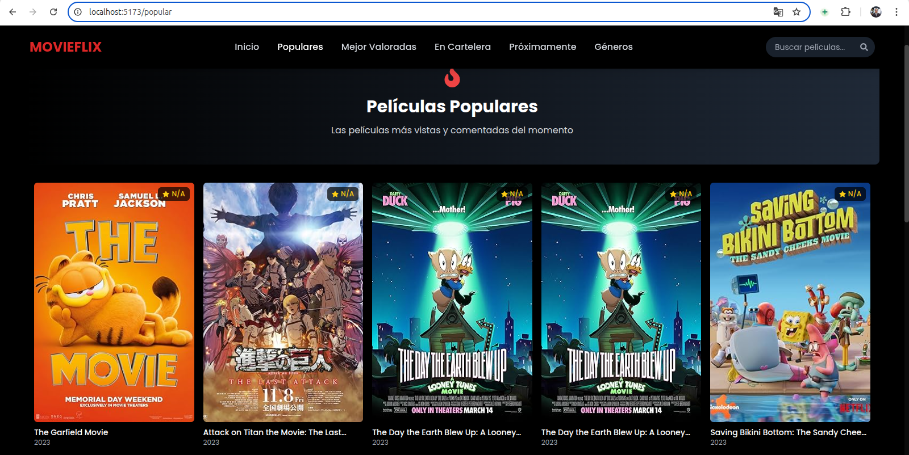

# 🎬 Movieflix - Plataforma de Streaming de Películas

[](https://github.com/VictorDev1986/MovieFlix)
[](LICENSE)
[](https://reactjs.org/)
[](https://www.typescriptlang.org/)
[](https://tailwindcss.com/)

Movieflix es una Single Page Application (SPA) estilo Netflix desarrollada con React, TypeScript y Vite. Esta aplicación consume la API de The Movie Database (TMDB) para ofrecer una experiencia completa de navegación y descubrimiento de películas, incluyendo información detallada, calificaciones, géneros y más.

<div align="center">
  
</div>


## 🌟 Características Principales

- **🎭 Interfaz tipo Netflix**: Diseño moderno inspirado en las mejores plataformas de streaming
- **🌙 Modo oscuro**: Experiencia visual optimizada para visualización nocturna
- **🔍 Búsqueda avanzada**: Encuentra películas por título, género o palabras clave
- **📱 Diseño responsivo**: Adaptación perfecta a cualquier dispositivo
- **🎞️ Filtrado por géneros**: Explora películas por categorías específicas
- **🏆 Sección de Top Rated**: Descubre las películas mejor valoradas
- **🔥 Películas populares**: Mantente al día con los títulos más vistos
- **🎟️ En cartelera**: Accede a información sobre los estrenos actuales

## 🎥 Demo

### 🌐 Demo en Vivo
[Ver Demo](https://moviefl.netlify.app)

### 📹 Video Demo

<div align="center">
  <div style="position: relative; padding-bottom: 56.25%; height: 0; max-width: 800px; margin: 0 auto;">
    <iframe 
      src="https://www.loom.com/embed/3fb7546154514dd2b00b32c28680cb03?sid=65f29067-c017-461c-b19f-3744d490bb82" 
      frameborder="0" 
      webkitallowfullscreen 
      mozallowfullscreen 
      allowfullscreen 
      style="position: absolute; top: 0; left: 0; width: 100%; height: 100%;">
    </iframe>
  </div>
</div>

<p align="center"><em>Video demostración de todas las funcionalidades de Movieflix - se reproduce directamente aquí.</em></p>

## 🛠️ Tecnologías Utilizadas

### Frontend
- **React 18** - Biblioteca principal para la interfaz de usuario
- **TypeScript** - Tipado estático para mejor mantenimiento
- **Vite** - Entorno de desarrollo ultrarrápido
- **TailwindCSS** - Framework CSS para estilos responsivos
- **React Router** - Navegación entre páginas
- **Axios** - Cliente HTTP para peticiones API
- **Zustand** - Gestión de estado global
- **React Icons** - Biblioteca de iconos
- **React Loading Skeleton** - Placeholders de carga

### API
- **The Movie Database (TMDB)** - Fuente de datos de películas

## 🚀 Empezando

### Prerrequisitos

- Node.js (versión 16 o superior)
- npm o yarn
- Clave API de TMDB (gratuita)

### Instalación

1. Clona el repositorio
   ```bash
   git clone https://github.com/VictorDev1986/MovieFlix.git
   cd MovieFlix
   ```

2. Instala las dependencias
   ```bash
   npm install
   # o
   yarn
   ```

3. Configura las variables de entorno
   Crea un archivo `.env` en la raíz con:
   ```
   VITE_TMDB_API_KEY=tu_api_key_aqui
   VITE_TMDB_API_BASE_URL=https://api.themoviedb.org/3
   VITE_TMDB_IMAGE_BASE_URL=https://image.tmdb.org/t/p
   ```

4. Inicia el servidor de desarrollo
   ```bash
   npm run dev
   # o
   yarn dev
   ```

5. Abre tu navegador en:
   ```
   http://localhost:5173
   ```

## 🤖 Desarrollo con IA Generativa

Este proyecto fue desarrollado con la asistencia de **Inteligencia Artificial Generativa**, utilizando herramientas avanzadas de IA para:

- **Arquitectura del proyecto**: Diseño y estructuración de componentes y servicios
- **Desarrollo de código**: Implementación de funcionalidades complejas con TypeScript y React
- **Optimización**: Mejoras en el rendimiento y las mejores prácticas de desarrollo
- **Documentación**: Creación de documentación clara y completa
- **Resolución de problemas**: Debugging y resolución de issues técnicos

La combinación de experiencia humana y asistencia de IA ha permitido crear una aplicación robusta, bien estructurada y con código de alta calidad, demostrando el potencial de la colaboración entre desarrolladores y herramientas de IA generativa.

## � Estructura del Proyecto

```
MovieFlix/
├── public/                # Archivos públicos estáticos
│   └── vite.svg          # Icono de la aplicación
├── src/                   # Código fuente
│   ├── assets/            # Imágenes, fuentes y recursos estáticos
│   ├── components/        # Componentes reutilizables
│   │   ├── layout/        # Componentes estructurales (Header, Footer, etc.)
│   │   └── ui/            # Componentes de interfaz (Cards, Buttons, etc.)
│   ├── pages/             # Componentes de nivel página (Inicio, Detalles, etc.)
│   ├── services/          # Servicios para API y funcionalidades externas
│   │   ├── tmdb.ts        # Cliente para comunicación con TMDB API
│   │   └── omdb.ts        # Cliente para OMDB API
│   ├── store/             # Estado global con Zustand
│   │   └── genreStore.ts  # Store para manejo de géneros
│   ├── types/             # Definiciones de tipos TypeScript
│   ├── App.tsx            # Componente raíz y configuración de rutas
│   ├── main.tsx           # Punto de entrada de la aplicación
│   └── index.css          # Estilos globales y configuración de Tailwind
├── .env                   # Variables de entorno (no incluido en git)
├── .gitignore             # Configuración de archivos ignorados por git
├── index.html             # HTML raíz para la aplicación
├── postcss.config.js      # Configuración de PostCSS para Tailwind
├── tailwind.config.js     # Configuración de TailwindCSS
├── tsconfig.json          # Configuración de TypeScript
└── vite.config.ts         # Configuración del bundler Vite
```

## 🎬 API de The Movie Database (TMDB)

Esta aplicación utiliza la API de The Movie Database (TMDB) para obtener información detallada sobre películas:

- Datos de películas populares, mejor calificadas, en cartelera y próximos estrenos
- Imágenes de alta calidad (posters, backdrops)
- Información detallada (reparto, sinopsis, valoraciones)
- Metadatos (géneros, duración, fecha de lanzamiento)

Para más información, visita la [documentación oficial de TMDB API](https://developers.themoviedb.org/3/getting-started/introduction).

## 🙌 Créditos y Agradecimientos

- **[The Movie Database (TMDB)](https://www.themoviedb.org/)** - Por su excelente API gratuita de películas
- **[React Icons](https://react-icons.github.io/react-icons/)** - Biblioteca de iconos utilizada en la aplicación
- **[TailwindCSS](https://tailwindcss.com/)** - Framework CSS para el diseño responsivo
- **Inspiración de diseño** - Basada en las mejores plataformas de streaming modernas

## 📜 Licencia

Este proyecto está licenciado bajo la **Licencia MIT** - consulta el archivo [LICENSE](LICENSE) para más detalles.

---

<div align="center">
  <p><strong>🎬 Movieflix</strong></p>
  <p>Desarrollado con ❤️ por <a href="https://github.com/VictorDev1986">Victor Sanchez</a></p>
  <p><em>Powered by React, TypeScript y IA Generativa</em></p>
</div>
